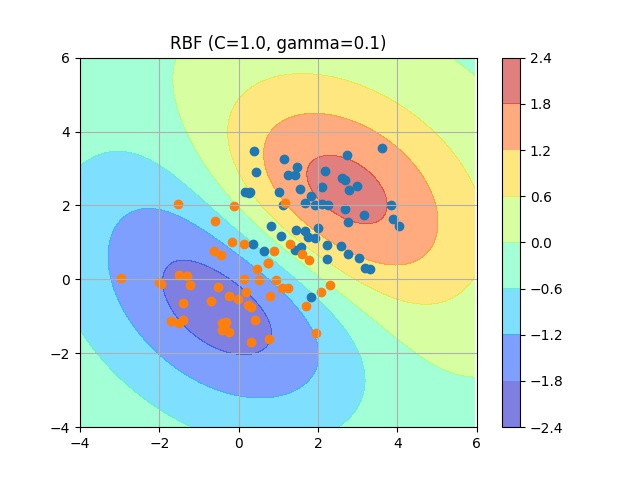

# SVM-SMO
Implementation of sequential minimal optimization algorithm for binary support vector classification in Python3.

- Platt, J. &nbsp; Fast Training of Support Vector Machines Using Sequential Minimal Optimization. 1998.
- Platt, J. &nbsp; Sequential Minimal Optimization: A Fast Algorithm for Training Support Vector Machines. 1998.
<br>

# Supplementary material
Supplementary material for the smo algorithm (in Japanese).


<br>

# Install
```
pip3 install numpy matplotlib
```
<br>

# Example
### RBF kernel
```
python3 example.py --kernel=rbf --C=1 --gamma=0.1  
```


<br>
### Linear kernel
```
python3 example.py --kernel=linear --C=1  
```


